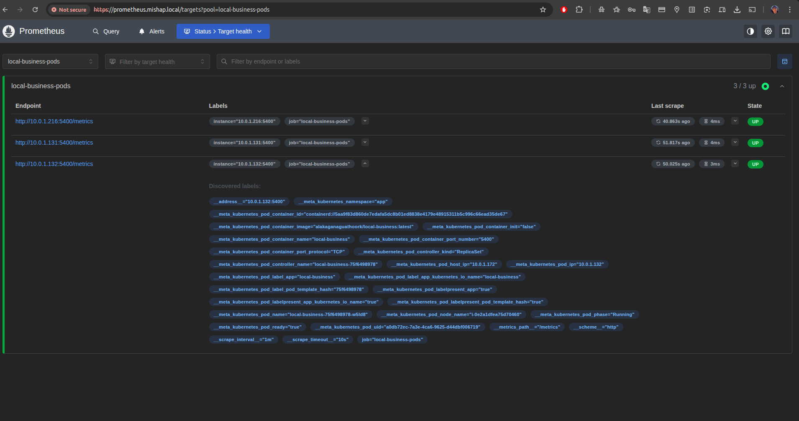

# Description

This project is a Local Business Open API that provides information about local businesses using data from RapidAPI. It allows users to search for businesses based on various criteria such as location, category, and ratings.

## Upd: 28/Oct/2025

As of this date a personal subscrition to RapidAPI's "Local Business Data API" has expired and the API is no longer accessible. Therefore, the functionality of this project is currently limited. The project structure, Docker setup, Helm charts, Terraform configurations, and monitoring stack remain intact for future use when access to the API is restored.

## TL;DR

- **App**: Flask app exposes `/` (with a redirect to `rapid_api_search`), `/test`, `/health`, `/metrics`

- **Image**: `Dockerfile` ( compressed size: 23.19 MB | download size: 61.1MB ) built & pushed by **Azure DevOps** to **Docker Hub** (*w/o vulnerabilities checks*)

- **Local run**: `docker-compose.yml` (app + monitoring stack)

- **Kubernetes**: full [Helm chart](https://github.com/alakaganaguathoork/local-business/tree/main/helm/charts/local-business) for the app; Argo CD used for GitOps deployment

- **Observability**: Prometheus rules/targets (the [alert](https://github.com/alakaganaguathoork/local-business/blob/main/monitoring/prometheus/prometheus.rules.yml) worked only [locally](https://github.com/alakaganaguathoork/local-business/tree/main/monitoring/alertmanager)), custom [Grafana dashboard](https://github.com/alakaganaguathoork/local-business/blob/main/monitoring/grafana/dashboards/main.json), Loki logs via Alloy ([#TBD](https://github.com/alakaganaguathoork/local-business/blob/main/monitoring/alloy/config/config%2Calloy))

- **IaC**: [Terraform](https://github.com/alakaganaguathoork/local-business/tree/main/terraform) for **AWS (EKS Auto mode)** with networking, security groups, RBAC, Helm releases (*Argo CD*, *Prometheus*, *Grafana*, *Loki*, *Alloy*); Terraform Cloud backend & webhook to Azure DevOps

- **CI/CD**: Azure DevOps pipeline runs on a [**self-hosted Docker agent**](https://github.com/alakaganaguathoork/azure-pipelines-agent) and can be triggered by **Terraform Cloud** after successful infra apply

- **Local cluster**: Vagrant project to bootstrap a test cluster

## Architecture

## Demo

## Notes

- The RapidAPI key is stored in .env file for local development and as a Kubernetes secret for production deployments.

- A shared Load Balancer with TLS termination is configured to route based on local hostnames. So, in order to make it work locally, you need to add the following entries to your `/etc/hosts` file with provisioned node IPs (also, `dnsmasq` can be used locally).

## Examples

### TLS self-signed certificate verification

### Prometheus with configured scraping of the Flask app's `/metrics` endpoint

### Grafana Node Exporter imported dashboard

### Grafana dashboard with custom panels for local-business metrics (not mastered yet, work in progress)

### ArgoCD Application for local-business Helm chart

## Additional stuff

### Alerting to Telegram bot (only from local setup via **Docker Compose**)

