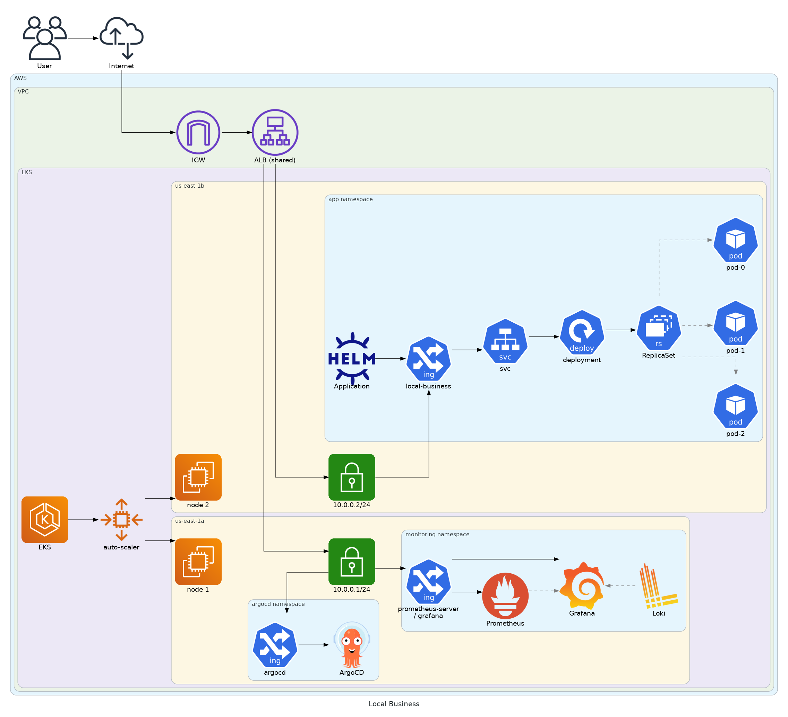
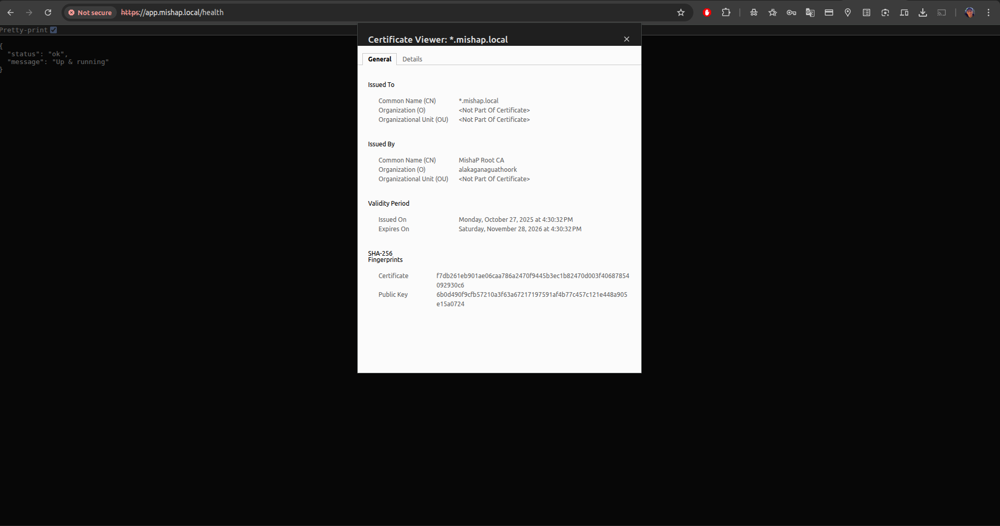
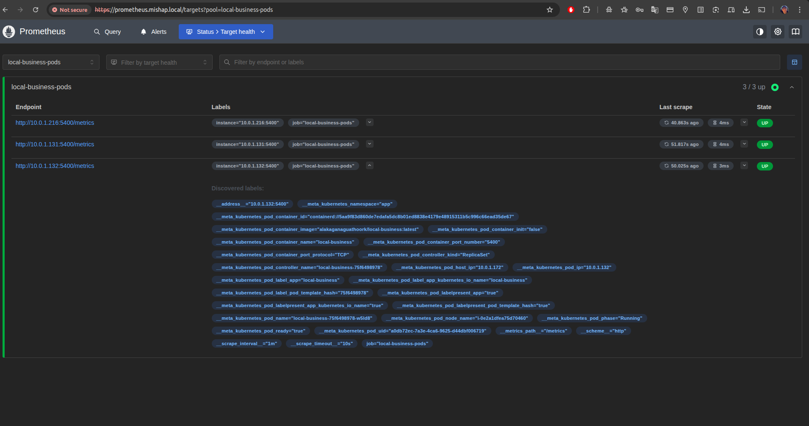
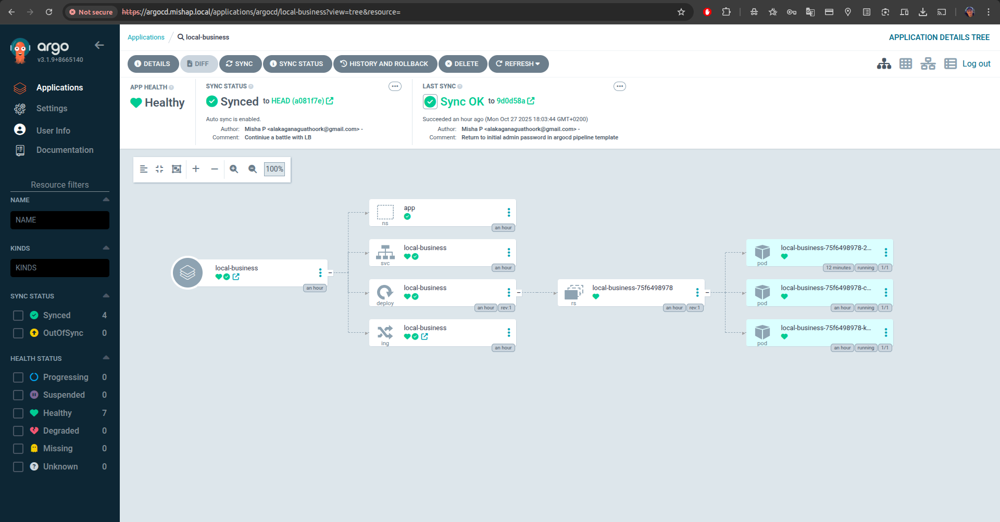

# Description

This project is a Local Business Open API that provides information about local businesses using data from RapidAPI. It allows users to search for businesses based on various criteria such as location, category, and ratings.

## TL;DR

- **App**: Flask app exposes `/` (with a redirect to `rapid_api_search`) `/test`, `/health`, `/metrics`
- **Image**: `Dockerfile` built & pushed by **Azure DevOps** to **Docker Hub**
- **Local run**: `docker-compose.yml` (app + monitoring stack)
- **Kubernetes**: full Helm chart for the app; Argo CD used for GitOps deployment
- **Observability**: Prometheus rules/targets/alerts, custom Grafana dashboard, Loki logs via Alloy
- **IaC**: Terraform for **Azure** and **AWS (EKS Auto mode)** with networking, security groups, RBAC, Helm releases (*Argo CD*, *Prometheus*, *Grafana*, *Loki*, *Alloy*); Terraform Cloud backend & webhook to Azure DevOps
- **CI/CD**: Azure DevOps pipeline runs on a **self-hosted Docker agent** and can be triggered by **Terraform Cloud** after successful infra apply
- **Local cluster**: Vagrant project to bootstrap a test cluster

## Architecture

## Notes:

* The RapidAPI key is stored in .env file for local development and as a Kubernetes secret for production deployments.

* A shared Load Balancer with TLS termination is configured to route based on local hostnames. So, in order to make it work locally, you need to add the following entries to your `/etc/hosts` file with provisioned node IPs (also, `dnsmasq` can be used locally).

## Examples

### TLS self-signed certificate verification:

### Prometheus with configured scraping of the Flask app's `/metrics` endpoint

### Grafana dashboard with custom panels for local-business metrics:

### ArgoCD Application for local-business Helm chart:

